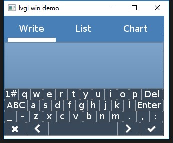
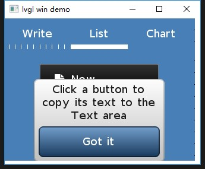
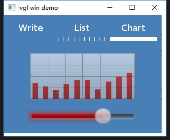
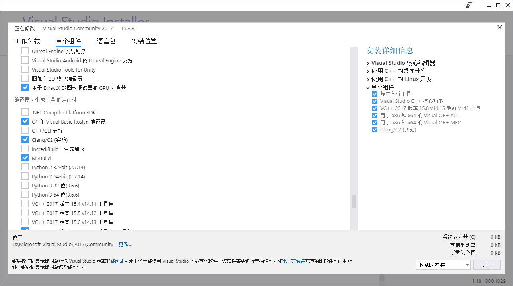

## Introduction

A simple and crude implement of lvgl windows demo.

## Setup

vs2017 with clang support. When you install vs2017 , you should select package clang.

## Run

Double click project/lvgl.sln,then press F5.

Enjoy!
